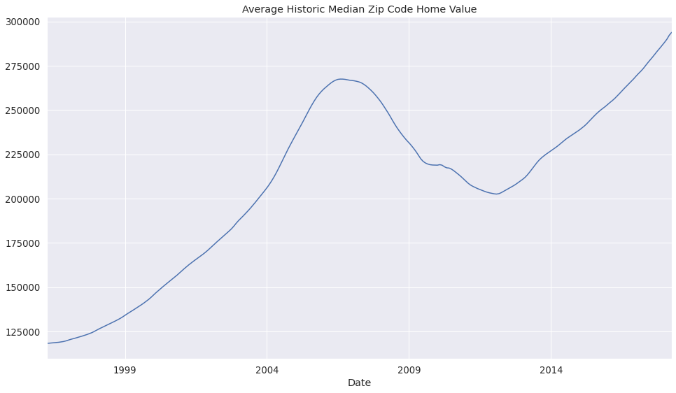
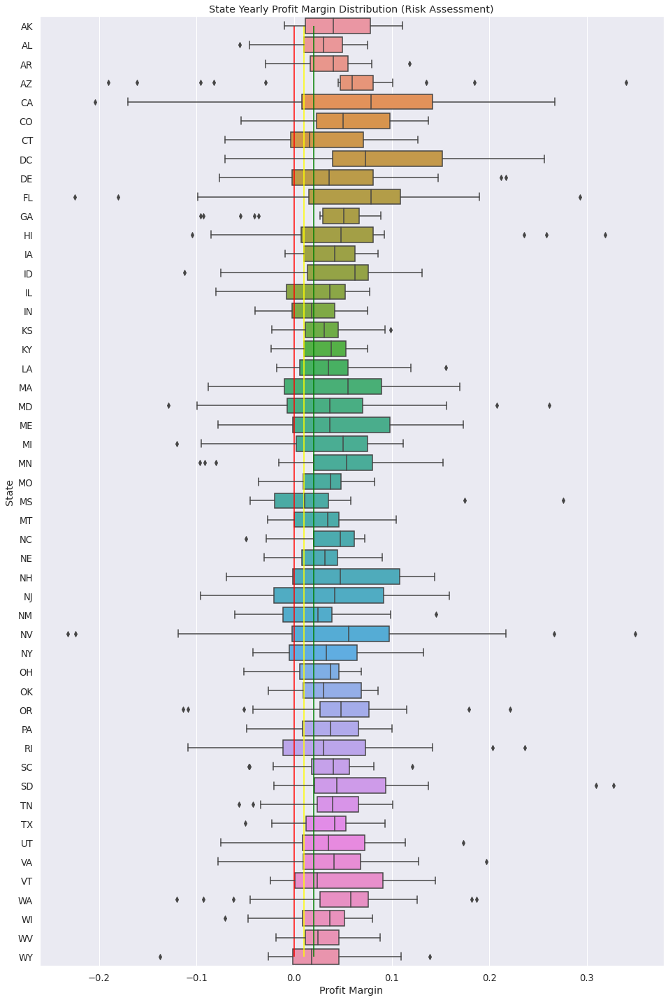
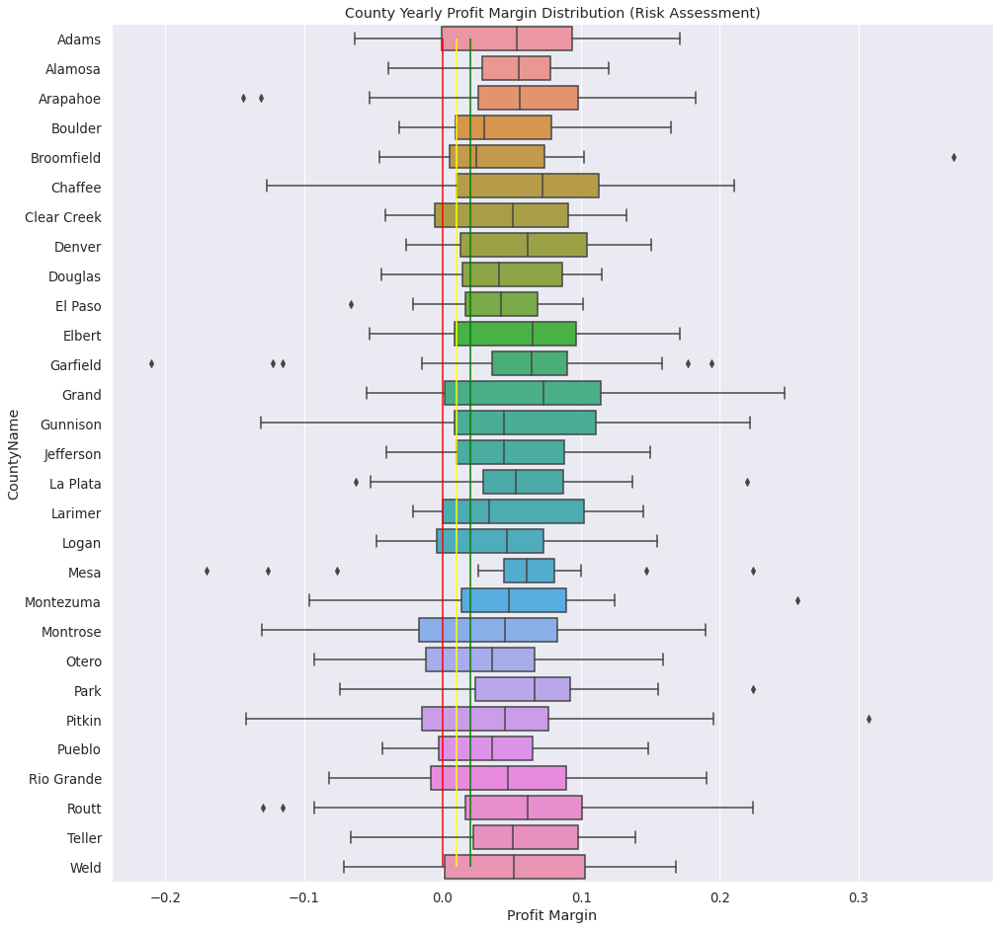
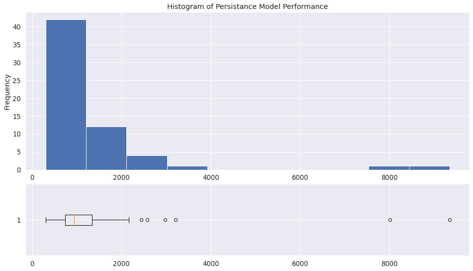

## Forecasting Real Estate Value

Modeling USA Real Estate Markets

---

## Problem Statement

There has been an increase in the amount of competitive firms
around _XYZ Realty LLC's_ region. They are seeking to expand/diversify their
portfolio of properties in areas outside of their local region. They have
a sizeable chunk of capital available to purchase properties, but want to
know **what are the 5 best zip codes to invest in?**

---

## Business Value

Note:

After the global economic collapse of 2007-2008, the housing market took a considgerable downturn. However,
since around 2011-12, the market has grown considerably well past it's former glory.

---

## Methodology

1. Obtaining Historical Median Home Value by Zip Code
2. Exploration of Data
3. Subsetting Data
4. Modeling (Baseline)
5. Modeling (ARIMA/SARIMAX)

Note:

Due to the large nature of our data (13k+ zip codes), we implemented automated tools to speed up the process of analyzing and forecasting the future value of homes. We also chose to
work with a subset of the original dataset, specifically
looking for areas with low risk associated with them.

--

# Market Analysis

-- <!-- .element: data-background-iframe="docs/visuals/02-Skellet0r-EDA_files/state_trend_over_time.html" data-preload-->

--

  

-- <!-- .element: data-background-iframe="docs/visuals/02-Skellet0r-EDA_files/co-opportunity.html" data-preload-->

--

# Colorado Market

-- <!-- .element: data-background-iframe="docs/visuals/02-Skellet0r-EDA_files/co-counties-trend.html" data-preload-->

--

### Risk Assessment

  

Note:

Instead of choosing a single county to look into,
we decided to review a collection of counties. We chose
4 counties with low risk, and 4 counties with high risk.

High Risk:

- Adams
- Chafee
- Gunnison
- Grand

Low Risk:

- Alamosa
- Park
- Teller
- Denver

---

## Modeling

- Baseline Model (Persistence)
- Advanced (SARIMA/ARIMA)

--

### Baseline Models RMSE Score Distribution

  

---

### Advanced Modeling Results

<table style="font-size: x-large;">
<thead>
<tr>
<th style="text-align:right"></th>
<th style="text-align:right">ZipCode</th>
<th style="text-align:right">RMSE</th>
<th style="text-align:right">Historic Median Value</th>
<th style="text-align:right">Proj. Min Value (12m)</th>
<th style="text-align:right">Proj. Max Value (12m)</th>
<th style="text-align:right">Proj. Min Net Profit</th>
<th style="text-align:right">Proj. Max Net Profit</th>
</tr>
</thead>
<tbody>
<tr>
<td style="text-align:right">1</td>
<td style="text-align:right">80203</td>
<td style="text-align:right">15,517.8</td>
<td style="text-align:right">$571,500</td>
<td style="text-align:right">$632,029</td>
<td style="text-align:right">$707,771</td>
<td style="text-align:right">$60,529.4</td>
<td style="text-align:right">$136,271</td>
</tr>
<tr>
<td style="text-align:right">2</td>
<td style="text-align:right">80218</td>
<td style="text-align:right">28,192.7</td>
<td style="text-align:right">$773,400</td>
<td style="text-align:right">$868,125</td>
<td style="text-align:right">$961,875</td>
<td style="text-align:right">$94,725.4</td>
<td style="text-align:right">$188,475</td>
</tr>
<tr>
<td style="text-align:right">3</td>
<td style="text-align:right">80211</td>
<td style="text-align:right">29,628.8</td>
<td style="text-align:right">$546,600</td>
<td style="text-align:right">$592,347</td>
<td style="text-align:right">$644,853</td>
<td style="text-align:right">$45,746.9</td>
<td style="text-align:right">$98,253.1</td>
</tr>
<tr>
<td style="text-align:right">4</td>
<td style="text-align:right">80220</td>
<td style="text-align:right">31,763.1</td>
<td style="text-align:right">$561,100</td>
<td style="text-align:right">$609,286</td>
<td style="text-align:right">$664,114</td>
<td style="text-align:right">$48,186.1</td>
<td style="text-align:right">$103,014</td>
</tr>
<tr>
<td style="text-align:right">5</td>
<td style="text-align:right">80212</td>
<td style="text-align:right">49,685.4</td>
<td style="text-align:right">$510,000</td>
<td style="text-align:right">$571,192</td>
<td style="text-align:right">$628,808</td>
<td style="text-align:right">$61,192.4</td>
<td style="text-align:right">$118,808</td>
</tr>
</tbody>
</table>

\* Projected values are with a 95% confidence level <!-- .element: style="font-size: large;"-->

--

  

--

  

-- 

  

--

  

--

  

---

## Recommendation: Best 5 Zip Codes

In Colorado

- 80203
- 80218
- 80211
- 80220
- 80212

---

## Future Work

1. Increase our modeling to the entire State of Colorado
2. Look into distributed training of our models
3. Increase the time horizon of our projections while keeping our RMSE scores below double their current value

---

# Thank You